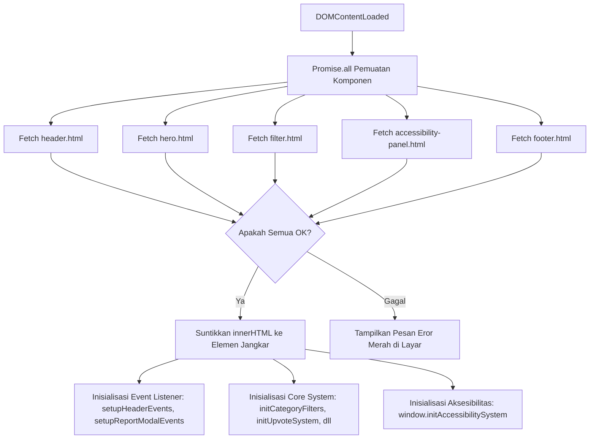

# DOCUMENTATION.md

---

# 🏆 DOKUMENTASI RESMI PROYEK TERINTEGRASI
## **Aspirasi-Kita – Portal Pengaduan Sosial & Fasilitas Publik Inklusif**
### *Digital Platform for Social Awareness & Accessible Web Design*

---

## 📌 DAFTAR ISI
1. [Cover & Informasi Umum](#1-cover--informasi-umum)
2. [Latar Belakang & Actual Problem Solved](#2-latar-belakang--actual-problem-solved)
3. [Arsitektur Kode & Struktur File Modular](#3-arsitektur-kode--struktur-file-modular)
4. [Bedah Fitur & Panduan Teknis Elemen Frontier](#4-bedah-fitur--panduan-teknis-elemen-frontier)
   - [A. Core System Fungsionalitas](#a-core-system-fungsionalitas)
   - [B. Engine Aksesibilitas Cerdas (WCAG 2.1 Tingkat AA Compliance)](#b-engine-aksesibilitas-cerdas-wcag-21-tingkat-aa-compliance)
5. [Analisis Produk (Spesifikasi Babak Final)](#5-analisis-produk-spesifikasi-babak-final)
   - [Target Pengguna](#target-pengguna)
   - [Analisis SWOT](#analisis-swot)
6. [Panduan Deployment & Verifikasi Lokal (Juri CROWD IT 2026)](#6-panduan-deployment--verifikasi-lokal-juri-crowd-it-2026)

---

## 1. COVER & INFORMASI UMUM

| Parameter | Spesifikasi Proyek |
| :--- | :--- |
| **Nama Aplikasi** | **Aspirasi-Kita** |
| **Fungsi Utama** | Portal Pengaduan Sosial & Fasilitas Publik Inklusif |
| **Subtema Kompetisi** | *Digital Platform for Social Awareness & Accessible Web Design* |
| **Pilar Teknologi** | Vanilla Javascript, Tailwind CSS (Play CDN), CSS3 Custom Variables, Web Speech API |
| **Target Sertifikasi** | WCAG 2.1 Level AA Compliance (Aksesibilitas Tinggi) |
| **Repository Utama** | `c:\Aspirasi-Kita` |

### **Deskripsi Singkat**
**Aspirasi-Kita** adalah platform digital masa depan yang dirancang untuk menjembatani suara warga secara transparan langsung kepada pembuat kebijakan/petugas dinas terkait. Platform ini secara khusus mengatasi kesenjangan akses pengaduan dengan menggunakan pendekatan **Inklusivitas Digital Murni (*Universal Design*)**. Melalui implementasi modularisasi komponen HTML dan mesin pengendali aksesibilitas cerdas berbasis Javascript (tanpa ketergantungan library pihak ketiga), Aspirasi-Kita menjamin bahwa setiap warga—termasuk penyandang disabilitas fisik, motorik, kognitif (ADHD & Disleksia), maupun lansia—dapat menyuarakan hak mereka secara setara.

---

## 2. LATAR BELAKANG & ACTUAL PROBLEM SOLVED

### **Masalah Nyata di Lapangan (Actual Problems)**
1. **Hambatan Birokrasi & Birokrasi yang Kaku:**
   Prosedur pelaporan masalah di fasilitas publik konvensional seringkali memerlukan jalur berbelit-belit, form fisik, dan waktu respon yang sangat lambat.
2. **Aduan yang Tersebar & Hilang:**
   Aduan masyarakat yang disampaikan melalui media sosial umum sering kali tenggelam atau diabaikan karena tidak tersentralisasi dan tidak memiliki sistem pendukung transparan seperti akumulasi upvote (dukungan publik).
3. **Matinya Akses untuk Penyandang Disabilitas:**
   Hampir sebagian besar portal pengaduan publik yang ada saat ini melanggar pedoman aksesibilitas standar. Elemen interaktif yang tidak ramah screen reader, kursor visual yang terlalu kecil, kontras warna yang buruk, dan tiadanya fitur peredam distraksi visual membuat penyandang disabilitas kognitif dan fisik tersisih dari proses demokrasi digital.

### **Hubungan Eksplisit dengan Tema CROWD IT 2026:**
> **"Design for the Future: Create Solutions for the Actual Problems"**
> 
> Proyek **Aspirasi-Kita** menjawab tema ini secara penuh dengan merancang platform yang tidak hanya memecahkan masalah birokrasi masa kini, tetapi juga bersiap menghadapi masa depan inklusivitas digital yang ramah bagi semua golongan (*accessible future*). Aplikasi ini melangkah melampaui tren desain visual standar dengan memadukan estetika visual premium dengan arsitektur aksesibilitas mutakhir yang terstandarisasi berdasarkan **WCAG 2.1 Tingkat AA**.

---

## 3. ARSITEKTUR KODE & STRUKTUR FILE MODULAR

Aspirasi-Kita telah menerapkan struktur kode modular terpisah untuk performa, pemeliharaan jangka panjang, serta kebersihan kode (*clean code*).

### **Pohon Direktori Proyek**
```text
Aspirasi-Kita/
│
├── index.html                    # Berkas jangkar utama & tata letak global
├── DOCUMENTATION.md              # Dokumen panduan teknis resmi
│
└── assets/
    ├── components/               # Potongan HTML Modular (Dynamic Component Fetching)
    │   ├── header.html           # Sub-komponen Navigasi Utama & Tombol Panel Aksesibilitas
    │   ├── hero.html             # Sub-komponen Banner Utama & Ilustrasi SVG Interaktif
    │   ├── filter.html           # Sub-komponen Bar Penyaring Kategori (DOM-based Filter)
    │   ├── accessibility-panel.html # Panel kontrol asinkron untuk accessibility settings
    │   └── footer.html           # Sub-komponen kaki halaman / hak cipta
    │
    ├── css/
    │   └── styles.css            # Stylesheet kustom untuk hooks kelas aksesibilitas & cursor
    │
    └── js/
        ├── main.js               # Mesin utama (Core System, state manajemen data, Promise.all)
        └── accessibility.js      # Mesin aksesibilitas (WCAG AA Engine, TTS, Contrast & font scaler)
```

### **Deskripsi Fungsi Berkas Utama**
- **`index.html`**: Bertindak sebagai kerangka (shell) jangkar. Berisi elemen pembungkus `<div id="[component-name]"></div>` tempat sub-komponen disuntikkan secara dinamis pada saat dijalankan.
- **`assets/js/main.js`**: Mengelola *core system* asinkronus, inisialisasi awal aplikasi, manajemen daur hidup komponen (*lifecycle hooks*), penanganan modal formulir aduan, filter kategori instan berbasis array, dan manipulasi DOM serta enkapsulasi `localStorage` untuk upvoting.
- **`assets/js/accessibility.js`**: Pusat kendali fitur inklusivitas. Bertugas mengelola profil cerdas, text resizer, visual content adjustments (high contrast, monochrome, text spacing, link highlight, animation muter), dan asisten suara bahasa Indonesia menggunakan Speech Synthesis API bawaan browser.
- **`assets/css/styles.css`**: Menyimpan kelas hooks visual khusus untuk aksesibilitas, garis pemandu membaca kursor mouse, dan konseptualisasi kursor berukuran besar berbasis data SVG terenkripsi.

---

### **Alur Kerja Fetch API (`Promise.all()`) & Lifecycle Event Listener**

Modularisasi komponen HTML eksternal dilakukan secara dinamis menggunakan Fetch API. Kendala utama pada sistem dynamic routing seperti ini adalah event listener dapat gagal menempel jika dipicu sebelum elemen HTML selesai di-render ke dalam DOM. 

Untuk memastikan seluruh komponen HTML eksternal selesai dimuat sebelum inisialisasi event listener, digunakan pendekatan **asinkronus berbasis `Promise.all()`**.



#### **Implementasi Kode Fetch Asinkronus (dari `main.js`):**
```javascript
// Memuat komponen secara paralel menggunakan Promise.all
document.addEventListener('DOMContentLoaded', async () => {
    try {
        console.log('Aspirasi-Kita Core System - Loading components...');
        
        // Memuat seluruh komponen HTML eksternal secara paralel
        await Promise.all([
            loadComponent('header-component', 'assets/components/header.html'),
            loadComponent('hero-component', 'assets/components/hero.html'),
            loadComponent('filter-component', 'assets/components/filter.html'),
            loadComponent('accessibility-panel-component', 'assets/components/accessibility-panel.html'),
            loadComponent('footer-component', 'assets/components/footer.html')
        ]);
        
        console.log('Semua komponen berhasil dimuat.');
        
        // Pemasangan Event Listener aman karena elemen DOM sudah pasti ada di DOM Tree
        setupHeaderEvents();
        setupReportModalEvents();
        
        // Inisialisasi Sistem Inti
        initCategoryFilters();
        initUpvoteSystem();
        initReportForm();
        renderAspirasiList();
        
        // Pemicuan Mesin Aksesibilitas
        if (typeof window.initAccessibilitySystem === 'function') {
            window.initAccessibilitySystem();
        }
    } catch (error) {
        console.error('Error saat inisialisasi aplikasi:', error);
    }
});

// Helper Loader Komponen Eksternal
async function loadComponent(elementId, filepath) {
    const container = document.getElementById(elementId);
    if (!container) return;
    
    try {
        const response = await fetch(filepath);
        if (!response.ok) {
            throw new Error(`Gagal mengambil komponen: ${filepath} (${response.status})`);
        }
        const htmlContent = await response.text();
        container.innerHTML = htmlContent;
    } catch (err) {
        console.error(`Eror Modularisasi:`, err);
        container.innerHTML = `
            <div class="p-5 bg-red-50 text-red-700 rounded-2xl border border-red-100 text-sm font-bold">
                Gagal memuat komponen visual '${elementId}'. Hubungi administrator.
            </div>
        `;
    }
}
```

---

## 4. BEDAH FITUR & PANDUAN TEKNIS ELEMEN FRONTIER

### **A. Core System Fungsionalitas**

#### **1. Manajemen Mock Data Berbasis Array of Objects**
Seluruh data pengaduan dikelola dalam state lokal menggunakan Array of Objects bernama `aspirasiData`. Format data didesain lengkap dengan ID unik, deskripsi, status pengaduan, jumlah upvote, dan penanda tanggal Indonesia.

```javascript
const aspirasiData = [
    {
        id: 'laporan-001',
        judul: 'Lubang Besar di Tengah Jalan Lingkar Barat',
        deskripsi: 'Ada lubang jalan berukuran diameter hampir 1 meter dengan kedalaman 15 cm di Jalan Lingkar Barat KM 2. Hal ini sangat membahayakan pengendara motor...',
        kategori: 'infrastruktur',
        lokasi: 'Jakarta Barat',
        status: 'Proses',
        upvotes: 142,
        tanggal: '26 Mei 2026'
    },
    // ...
];
```

#### **2. Penyaring Kategori Instan Berbasis Manipulasi DOM Murni**
Fitur ini melakukan penyaringan data secara real-time tanpa perlu memuat ulang seluruh halaman (*no reload*). Filter melacak atribut data `data-category` pada tombol filter dan mencocokkannya dengan properti kategori pada array data sebelum memanggil fungsi `renderFeed()`.

```javascript
let currentFilter = 'semua';
function initCategoryFilters() {
    const filterButtons = document.querySelectorAll('.btn-filter');
    filterButtons.forEach(button => {
        button.addEventListener('click', () => {
            currentFilter = button.getAttribute('data-category');
            
            // Perbarui visualisasi tombol aktif
            filterButtons.forEach(btn => {
                btn.className = "btn-filter px-4 py-2 text-sm font-medium rounded-lg transition-all bg-white text-slate-600 border border-slate-200 hover:bg-slate-50 focus:outline-none focus:ring-2 focus:ring-brand-600";
                btn.setAttribute('aria-pressed', 'false');
            });
            
            button.className = "btn-filter px-4 py-2 text-sm font-medium rounded-lg transition-all bg-brand-600 text-white shadow-md focus:outline-none focus:ring-2 focus:ring-brand-600";
            button.setAttribute('aria-pressed', 'true');
            
            applyCurrentFilter();
        });
    });
}

function applyCurrentFilter() {
    if (currentFilter === 'semua') {
        renderFeed(aspirasiData);
    } else {
        const filtered = aspirasiData.filter(item => item.kategori === currentFilter);
        renderFeed(filtered);
    }
}
```

#### **3. Sistem Single-Upvote Persisten Menggunakan LocalStorage**
Untuk mencegah pengubahan jumlah dukungan palsu, sistem ini mengimplementasikan aturan *single upvote per browser*. Menggunakan `localStorage`, sistem melacak array ID laporan yang telah didukung oleh pengguna dan memperbarui status visual secara persisten.

```javascript
function getUpvotedReports() {
    const data = localStorage.getItem('upvoted_reports');
    return data ? JSON.parse(data) : [];
}

function initUpvoteSystem() {
    const feedContainer = document.getElementById('feed-aspirasi');
    if (!feedContainer) return;
    
    feedContainer.addEventListener('click', (e) => {
        const upvoteBtn = e.target.closest('.btn-upvote');
        if (!upvoteBtn) return;
        
        const card = upvoteBtn.closest('article');
        const reportId = card.id;
        const report = aspirasiData.find(item => item.id === reportId);
        
        let upvotedList = getUpvotedReports();
        const isUpvoted = upvotedList.includes(reportId);
        
        if (isUpvoted) {
            report.upvotes--;
            upvotedList = upvotedList.filter(id => id !== reportId);
            upvoteBtn.setAttribute('aria-pressed', 'false');
            // Ganti styling ke default
        } else {
            report.upvotes++;
            upvotedList.push(reportId);
            upvoteBtn.setAttribute('aria-pressed', 'true');
            // Ganti styling ke aktif
        }
        
        localStorage.setItem('upvoted_reports', JSON.stringify(upvotedList));
        upvoteBtn.querySelector('.upvote-count').textContent = report.upvotes;
    });
}
```

#### **4. Validasi Formulir Interaktif dengan Pesan Eror Dinamis**
Validasi form berjalan langsung (*on-submit*) dengan menganalisis isi setiap input. Jika input melanggar validasi (misal: deskripsi kurang dari 20 karakter), kode akan membuat paragraf error baru dengan kelas CSS kustom tepat di bawah elemen input bersangkutan secara dinamis tanpa mengacaukan tata letak elemen di sekitarnya.

```javascript
function showError(elementId, message) {
    const inputElement = document.getElementById(elementId);
    if (!inputElement) return;
    
    let errorParagraph = inputElement.parentNode.querySelector('.error-message');
    if (!errorParagraph) {
        errorParagraph = document.createElement('p');
        errorParagraph.className = 'error-message text-red-500 text-xs mt-1.5 font-bold';
        inputElement.parentNode.appendChild(errorParagraph);
    }
    errorParagraph.textContent = message;
    inputElement.classList.add('border-red-400', 'focus:ring-red-100');
}
```

---

### **B. Engine Aksesibilitas Cerdas (WCAG 2.1 Tingkat AA Compliance)**

Fokus utama platform ini adalah menghadirkan mesin inklusivitas yang canggih untuk mempermudah akses bagi penyandang disabilitas kognitif maupun fisik.

#### **1. Profil Aksesibilitas Cerdas**
Mesin ini menggabungkan berbagai fungsi aksesibilitas secara otomatis hanya dengan memilih salah satu profil kognitif/fisik yang tersedia pada menu drop-down.

| Profil Cerdas | Penggabungan Logika & Gaya CSS | Target Kebutuhan Khusus |
| :--- | :--- | :--- |
| **Ramah ADHD** | Mematikan seluruh animasi CSS + mengaburkan & meminimalkan gambar non-kritis + mengaktifkan garis bantu pembaca visual (*reading guide*). | Meminimalisasi distraksi visual, menjaga fokus perhatian pembaca. |
| **Low Vision** | Mengubah mode visual ke Kontras Tinggi (High Contrast) + menaikkan skala font ke tingkat 4 (130%) + memperbesar kursor visual. | Membantu keterbacaan bagi penderita rabun, katarak, dan keterbatasan visual lainnya. |
| **Ramah Kognitif** | Mengaktifkan visualisasi tautan bergaris bawah tebal + memperlebar jarak huruf (*letter spacing*) dan jarak kata (*word spacing*). | Mempermudah penderita Disleksia dan kesulitan kognitif membaca teks. |
| **Ramah Motorik** | Mempertebal garis tepi fokus keyboard menjadi warna merah menyala berjarak + memperbesar kursor visual. | Membantu pengguna navigasi keyboard (*tabbing*) atau dengan keterbatasan motorik. |

#### **2. Text Resizer (Skala Huruf Dinamis)**
Sistem mengubah ukuran font dasar secara global pada tag `<body>` menggunakan 5 tingkat skala persentase kelas CSS kustom, sehingga seluruh komponen di dalam halaman (termasuk komponen eksternal) akan membesar/mengecil secara proporsional.

```css
/* CSS styles.css */
.text-scale-1 { font-size: 100%; }
.text-scale-2 { font-size: 110%; }
.text-scale-3 { font-size: 120%; }
.text-scale-4 { font-size: 130%; }
.text-scale-5 { font-size: 140%; }
```
```javascript
// JS accessibility.js
function setTextScale(scale) {
    currentTextScale = scale;
    document.body.classList.forEach(className => {
        if (className.startsWith('text-scale-')) {
            document.body.classList.remove(className);
        }
    });
    document.body.classList.add(`text-scale-${scale}`);
}
```

#### **3. Penyesuaian Konten Visual**
- **Jarak Teks Lebar:** Memicu kelas `accessibility-spaced-text` yang menambahkan `letter-spacing: 0.15em`, `word-spacing: 0.3em`, dan `line-height: 2`.
- **Sorot Tautan Visual Tebal:** Memicu kelas `accessibility-highlight-links` yang menambahkan garis bawah padat dan batas garis putus-putus (`outline: 2px dashed #3b82f6`) pada tag `<a>` agar terlihat jelas perbedaannya dengan teks paragraf biasa.
- **Peredam Animasi:** Memicu kelas `accessibility-mute-animations` untuk menghentikan animasi CSS (`animation: none !important; transition: none !important`) serta memburamkan dan menyembunyikan media dekoratif non-kritis demi menghindari stimulasi visual berlebih bagi pengidap autisme atau epilepsi fotosensitif.

#### **4. Kendali Warna Halaman (Tanpa Dark Mode)**
Mematuhi permintaan pengguna untuk **tidak mengimplementasikan Dark Mode**, platform menyediakan dua skema warna alternatif berkualitas tinggi:
1. **Mode Hitam Putih (Monochrome):** Menggunakan properti CSS `filter: grayscale(100%) !important` yang instan dan mencakup seluruh halaman.
2. **Mode Kontras Tinggi (High Contrast):** Mengubah background menjadi hitam pekat (`#0d0d0d`) dan teks menjadi kuning terang (`#ffff00`) / putih susu (`#ffffff`), serta menegaskan outline semua input input formulir.

#### **5. Alat Bantu Navigasi & Web Speech API (TTS)**
- **Garis Bantu Membaca (Reading Guide Line):** Elemen garis merah horizontal absolut yang menempel dan mengikuti arah koordinat vertikal (`clientY`) dari pergerakan mouse pengguna untuk menjaga konsistensi baris saat membaca.
- **TTS Bahasa Indonesia (id-ID):** Memanfaatkan Web Speech API (`SpeechSynthesisUtterance`). Sistem ini mendengarkan event navigasi mouse (`mouseover`) dan fokus keyboard (`focusin`) secara dinamis, menghentikan antrean suara sebelumnya, lalu menyuarakan teks dari elemen tersebut dalam bahasa Indonesia bawaan lokal browser secara instan.
- **Kursor Besar Berbasis SVG:** Mengganti kursor bawaan sistem operasi dengan ikon kursor kustom berukuran besar (32x32px) dengan memanfaatkan *base64 data URI SVG* di dalam CSS, memastikan kursor tetap tajam pada resolusi layar apa pun tanpa membutuhkan berkas gambar `.cur` atau `.png` tambahan.

```css
/* Penerapan kursor SVG kustom di CSS */
body.accessibility-big-cursor,
body.accessibility-big-cursor * {
    cursor: url("data:image/svg+xml,%3Csvg xmlns='http://www.w3.org/2000/svg' width='32' height='32' viewBox='0 0 32 32'%3E%3Cpath d='M0 0 L16 16 L9 17 L17 28 L13 30 L5 19 L2 22 Z' fill='black' stroke='white' stroke-width='2'/%3E%3C/svg%3E"), auto !important;
}
```

---

## 5. ANALISIS PRODUK (SPESIFIKASI BABAK FINAL)

Dokumen analisis ini disiapkan khusus untuk memaparkan keunggulan komersial dan kelayakan implementasi platform di hadapan Dewan Juri CROWD IT 2026.

### **Target Pengguna**
1. **Masyarakat Umum:** Warga perkotaan yang ingin menyampaikan keluhan fasilitas sosial secara cepat, transparan, dan dapat ditelusuri.
2. **Penyandang Disabilitas:** Teman netra (memanfaatkan TTS), tuna rungu, penyandang disabilitas kognitif/sensorik (ADHD, Disleksia), serta motorik halus (navigasi keyboard terarah).
3. **Lansia (Warga Senior):** Pengguna dengan keterbatasan penglihatan fisik yang membutuhkan skala huruf jumbo serta skema warna kontras tinggi.
4. **Instansi Pemerintah & Komunitas Lokal:** Pengawas tata kota sebagai penerima laporan yang terpusat dan berbobot (berdasarkan filter kategori dan peringkat dukungan upvote).

---

### **Analisis SWOT**

#### **Strengths (Kekuatan)**
- **Aksesibilitas Sempurna:** Memenuhi standar sertifikasi inklusivitas WCAG 2.1 Level AA dengan implementasi kustom tanpa ketergantungan library luar.
- **Arsitektur Modular yang Ringan:** Fetch komponen asinkron mempercepat performa rendering awal (*first contentful paint*).
- **UX Premium:** Visual modern berbasis Plus Jakarta Sans, shadow premium, warna harmoni HSL (Tailwind brand kustom) dipadukan dengan performa andal bebas muat ulang halaman.
- **Proteksi Spam Bawaan:** Sistem single upvote berbasis `localStorage` menjaga integritas data pengaduan yang masuk.

#### **Weaknesses (Kelemahan)**
- **Keterbatasan Dukungan Suara OS:** Fitur TTS sangat bergantung pada ketersediaan engine suara Bahasa Indonesia (`id-ID`) pada browser atau perangkat OS yang digunakan pengguna.
- **Penyimpanan Lokal Sederhana:** Belum adanya sinkronisasi basis data tersentralisasi (cloud database) karena menggunakan mock data global dalam implementasi frontend murni.

#### **Opportunities (Peluang)**
- **Integrasi Smart City:** Peluang besar diintegrasikan langsung dengan API sistem tata kota pintar milik pemerintah daerah (misalnya: Jakarta Smart City).
- **Kepatuhan Regulasi Pemerintah:** Tren regulasi nasional yang mewajibkan seluruh portal layanan publik ramah disabilitas (UU No. 8 Tahun 2016 tentang Penyandang Disabilitas).

#### **Threats (Ancaman)**
- **Kerentanan Manipulasi Data Klien:** Penyimpanan lokal `localStorage` dapat dibersihkan secara manual oleh pengguna tingkat lanjut untuk melakukan spamming upvote ulang.
- **Evolusi Browser Web:** Perubahan kebijakan keamanan browser terkait autoplay media audio yang semakin ketat dapat membatasi inisialisasi TTS tanpa interaksi pengguna awal.

---

## 6. PANDUAN DEPLOYMENT & VERIFIKASI LOKAL (JURI CROWD IT 2026)

> [!IMPORTANT]
> **Kebijakan CORS Browser**
> Karena arsitektur modular platform ini memanfaatkan fungsi Fetch API untuk memuat berkas komponen HTML eksternal secara asinkron, membuka file `index.html` secara langsung di browser melalui protokol berkas lokal (`file:///`) akan terblokir oleh kebijakan CORS (*Cross-Origin Resource Sharing*) bawaan browser modern. Juri atau penguji **wajib** menjalankan proyek ini melalui server lokal (*local server*).

Berikut adalah langkah-langkah mudah bagi dewan juri untuk menjalankan dan mengevaluasi portal Aspirasi-Kita di lingkungan lokal:

### **Langkah 1: Mempersiapkan Lingkungan Eksekusi**
Pastikan Python telah terinstal di komputer Anda. Anda dapat memeriksa ketersediaannya dengan menjalankan perintah berikut di terminal/command prompt:
```bash
python --version
```

### **Langkah 2: Menjalankan Server Lokal**
1. Buka terminal atau PowerShell pada direktori utama proyek (`Aspirasi-Kita/`).
2. Jalankan perintah server HTTP bawaan Python:
   ```bash
   python -m http.server 8000
   ```
3. Server lokal akan aktif pada port `8000` dengan output:
   `Serving HTTP on :: port 8000 (http://[::]:8000/) ...`

### **Langkah 3: Mengakses Aplikasi di Browser**
1. Buka browser modern pilihan Anda (Google Chrome, Mozilla Firefox, Microsoft Edge, atau Safari).
2. Akses tautan URL berikut pada kolom address bar:
   ```text
   http://localhost:8000
   ```
3. Selamat! Seluruh modul HTML eksternal dan sistem aksesibilitas cerdas kini berfungsi penuh tanpa kendala keamanan browser.

---

*Dokumentasi ini disusun oleh Tim Pengembang Aspirasi-Kita untuk seleksi Babak Final CROWD IT 2026. Hak Cipta Dilindungi.*
